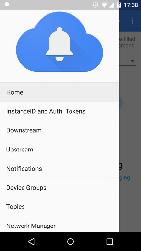
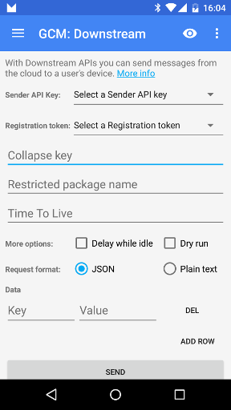
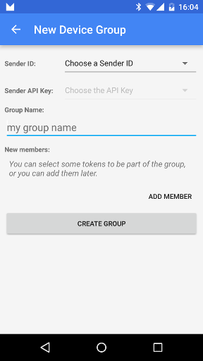
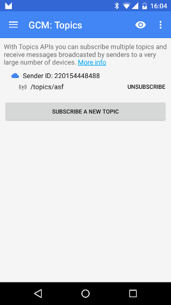
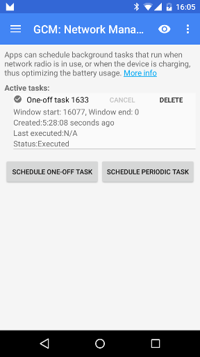

Google Cloud Messaging - Android Demo App
==========================================

This is a demo app used to demonstrate demonstrates various aspects of
interacting with GCM on Android. Specifically, it covers:

* Registering a client app
* Sending downstream, upstream and notification messages
* Subscribing to topics
* Creating notification groups
* Using the network manager to schedule tasks

A full GCM implementation requires both a client implementation and a server
implementation. For more information on GCM, including an overview and
integration instructions, see
[Cloud Messaging](https://developers.google.com/cloud-messaging/).

## Getting Started

This sample uses the Gradle build system. To build this project, use the
"gradlew build" command or use "Import Project" in Android Studio. To use the
app you will need a sender ID to be able to register and test client side APIs,
and an API key to be able to test server side APIs. For more information, see
[Implementing GCM Client on Android](https://developers.google.com/cloud-messaging/android/client).

## Screenshots

## Support

- Google+ Community: https://plus.sandbox.google.com/communities/105153134372062985968
- Stack Overflow: http://stackoverflow.com/questions/tagged/google-cloud-messaging

If you've found an error in this project's code, please file an issue:
https://github.com/google/gcm/issues

## License

Copyright 2015 Google, Inc.

Licensed to the Apache Software Foundation (ASF) under one or more contributor
license agreements.  See the NOTICE file distributed with this work for
additional information regarding copyright ownership.  The ASF licenses this
file to you under the Apache License, Version 2.0 (the "License"); you may not
use this file except in compliance with the License.  You may obtain a copy of
the License at

  http://www.apache.org/licenses/LICENSE-2.0

Unless required by applicable law or agreed to in writing, software
distributed under the License is distributed on an "AS IS" BASIS, WITHOUT
WARRANTIES OR CONDITIONS OF ANY KIND, either express or implied.  See the
License for the specific language governing permissions and limitations under
the License.
